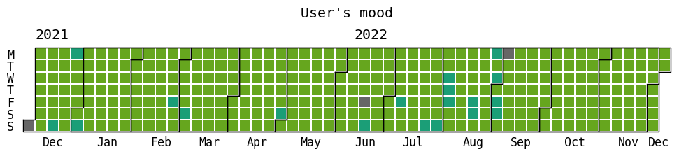

# SpotifyApp

Welcome to the GitHub repository of my Spotify Mood Tracker project in Python!

The goal of this project is to track the mood of users on a daily basis by analyzing their Spotify listening history. The application uses the Spotify API to extract user's listening data, including musical genre, tempo, tone, and energy, and then uses data processing and machine learning techniques to determine the mood of each day.

The requirements.txt file included in the repository lists all the required Python dependencies to run the application. To install these dependencies, please execute the following command:

```
pip install -r requirements.txt
```

In this project, Spotify's credentials are set as environment variable. You fill have to set them before running the code.

```
export SPOTIFY_CLIENT_ID=""
export SPOTIFY_CLIENT_SECRET=""
```


The repository also contains examples of Spotify listening data to aid in testing the application. The data folder contains CSV files representing my listening history. You can use these files to test the application and see how it works. You can also download your own ListeningHistory on Spotify.

The main.py file contains the main code of the application, which uses the Spotify API and Python libraries to extract and analyze the listening data. The machine learning model is trained using scikit-learn and pickle is used to save the trained models.

Here you can see an example of what the calendar produced by this project looks like : 


Have fun tracking your daily mood using your Spotify listening history!
